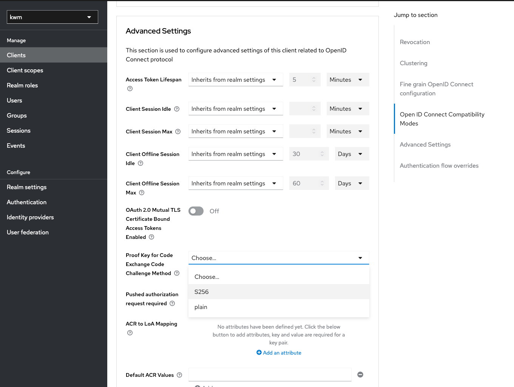

# Adding Keycloak authentication to Relying Party client

Keycloak maintains a javascript library (Keycloak Client Adapter) called keycloak-js. These code examples have been tested in Kiuru Web Manager.

## Proof Key for Code Exchange (PKCE)

When seeking access tokens, additional security considerations arise for public clients like native and single-page applications. The Authorization Code Flow, on its own, does not fully address these concerns. Here's why:

For Native apps:
1. Insecure Client Secret Storage: Native applications lack a secure means to store a Client Secret. Decompiling the app exposes the Client Secret, which is uniform across all users and devices.
2. Custom URL Scheme Vulnerability: Some native apps utilize a custom URL scheme (e.g., MyApp://) for redirects. This opens the door for potential malicious applications to intercept an Authorization Code from the Authorization Server.

For Single-page apps:

1. Client Secret Exposure: The entire source code of single-page apps is accessible to the browser, making it impossible to securely store a Client Secret.

In response to these challenges, OAuth 2.0 introduces a variant of the Authorization Code Flow known as Proof Key for Code Exchange (PKCE), as outlined in OAuth 2.0 RFC 7636.

The PKCE-enhanced Authorization Code Flow involves the creation of a secret by the calling application, known as the Code Verifier. Alongside this, the calling app generates a transformed value of the Code Verifier, termed the Code Challenge. This Code Challenge is transmitted securely over HTTPS to obtain an Authorization Code. This approach ensures that even if an attacker intercepts the Authorization Code, they cannot exchange it for a token without possessing the Code Verifier.

## Enabling PKCE in Keycloak Admin UI

You have the possibility of choosing to not to force the use of PKCE, in which case you should not enable it.

If relying party's client sends an authorization request with appropriate code challenge and code exchange method, PKCE will be used wether it is enabled for the client or not.

To force PKCE in admin UI:


1. Select your RPs client from the list
2. Navigate to "Advanced" tab
3. Scroll down to "Advanced settings" part
4. Select a Proof Key for Code Exchange Code Challenge Method
5. Select S256 (SHA-256) as shown in the image below.




## Supporting PKCE with keycloak-js

Add keycloak-js to your project dependencies:

```
yarn add keycloak-js
or
npm i keycloak-js
```

Methods we need:

1. generateRandomCodeVerifier() - To generate a Code Verifier
2. calculateCodeChallenge() - To calculate a Code Challenge
3. loginWithKeycloak() - To call when using pressed "Login with OIDC"

In our case, all functions are inside Vue.js sepcific methods block.

generateRandomCodeVerifier():

```javascript
generateRandomCodeVerifier() {
  const codeVerifierLength = 64;
  const codeVerifierArray = new Uint8Array(codeVerifierLength);
  crypto.getRandomValues(codeVerifierArray);

  // Encode the random bytes as Base64 URL-safe characters.
  const base64 = btoa(String.fromCharCode.apply(null, codeVerifierArray))
      .replace(/\+/g, "-")
      .replace(/\//g, "_")
      .replace(/=+$/, "");

  return base64;
},

```

```javascript
// Function to calculate the code challenge from the code verifier
calculateCodeChallenge(codeVerifier) {
  const encoder = new TextEncoder();
  const data = encoder.encode(codeVerifier);
  return crypto.subtle.digest('SHA-256', data).then(buffer => {
    const hashArray = Array.from(new Uint8Array(buffer));
    return hashArray.map(byte => String.fromCharCode(byte)).join('');
  });
},
```


loginWithKeycloak():

```javascript
async loginWithKeycloak() {

  // Generate the code verifier and store it in localStorage
  // Stored verifier should be deleted when it is no longer needed.
  const codeVerifier = this.generateRandomCodeVerifier();
  localStorage.setItem("verifier", codeVerifier);

  // Calculate challenge from verifier, encode to Base64
  let baseChallenge = null;
  await this.calculateCodeChallenge(codeVerifier)
      .then(codeChallenge => {
        baseChallenge = btoa(codeChallenge)
            .replace(/=/g, '')
            .replace(/\+/g, '-')
            .replace(/\//g, '_')
      })

  // Specify keycloak URL with port, realm, clientId you created
  let initOptions = {
    url: 'http://localhost:8080/',
    realm: 'kwm',
    clientId: 'kwm',
    onLoad: 'login-required',
  };
  /*
    Possible onLoad values:
    - login-required (force login everytime)
    - check-sso (login automatically if session is available)
    - none (client application decides action)
  */

  const keycloak = new Keycloak(initOptions);

  // We append these to the login URL
  // If dtbd is not defined, keycloak will use default authn message
  // configured in Keycloak admin UI
  const customData = {
    dtbd: 'Please authenticate to this service or else',
    code_challenge_method: "S256",
    code_challenge: baseChallenge,
    msisdn : "35847001001" // Depending on the configured flow, this might be required
  };

  try {
    const authenticated = await keycloak.init(initOptions.onLoad);

    // returns URL to login form
    let loginUrl = keycloak.createLoginUrl();

    // Add custom parameters to the login URL
    for (const key in customData) {
      if (customData.hasOwnProperty(key)) {
        loginUrl += `&${key}=${encodeURIComponent(customData[key])}`;
      }
    }

    // redirect the old-fashioned way since we are using custom parameters hence cant use keycloak.login()
    window.location.href = loginUrl;

    console.log(`User is ${authenticated ? 'authenticated' : 'not authenticated'}`);
  } catch (error) {
    console.error('Failed to initialize adapter:', error);
  }

},
```


At this point, you have the code you need to get redirected to Keycloak login form. After you successfully authenticate, you need to handle the redirect in your javascript app. The redirect contains Authorization code, which we can exchange In Vue.js, we do this by using a lifecycle hook called created():

```javascript
async created() {
  // Parse the URL fragment parameters
  const urlParams = new URLSearchParams(window.location.hash.substring(1)); 

  // Check if the URL fragment contains an "error" parameter indicating an authentication error
  if (urlParams.has('error')) {
    const errorMessage = urlParams.get('error_description');
    console.error('Authentication error:', errorMessage);
    // Handle the error appropriately in your application
  } else {
    // Check if the URL fragment contains an "code" parameter indicating a successful authentication
    if (urlParams.has('code')) {
      const authorizationCode = urlParams.get('code');
      console.log('Authorization Code:', authorizationCode);
      // You can use this authorization code to exchange for tokens on your server if needed

      // Prepare to send authorization code and code verifier to get the tokens
      const clientId = 'kwm';
      const keycloakUrl = 'http://localhost:8080/realms/kwm/protocol/openid-connect/token';
      const tokenData = {
        grant_type: 'authorization_code',
        client_id: clientId,
        code: authorizationCode,
        redirect_uri: 'http://localhost:8081/keycloak-login', // Must match your Keycloak client configuration
        code_verifier: localStorage.getItem("verifier") // get the code from storage
      };

      axios
          .post(keycloakUrl, new URLSearchParams(tokenData), {
            headers: { 'Content-Type': 'application/x-www-form-urlencoded' },
          })
          .then((response) => {
            const accessToken = response.data.access_token;
            const idToken = response.data.id_token;
            const refreshToken = response.data.refresh_token;

            // Use the access token and ID token as needed in your application
            console.log('Access Token:', accessToken);
            console.log('ID Token:', idToken);
            console.log('refresh token: ')
            this.accessToken = accessToken;
            this.idToken = idToken;
            this.refreshToken = refreshToken;
            localStorage.removeItem("verifier") // Remove verifier from storage
          })
          .catch((error) => {
            console.error('Error exchanging authorization code for tokens:', error);
            localStorage.removeItem("verifier")
          });

    }

    // Check if the URL fragment contains an "access_token" parameter indicating an access token
    if (urlParams.has('access_token')) {
      const accessToken = urlParams.get('access_token');
      console.log('Access Token:', accessToken);
      // Use the access token as needed in your application
    }

    // Check if the URL fragment contains an "id_token" parameter indicating an ID token
    if (urlParams.has('id_token')) {
      const idToken = urlParams.get('id_token');
      console.log('ID Token:', idToken);
      // Use the ID token as needed in your application (e.g., for user authentication)
    }
  }

  // You can also clear the fragment parameters from the URL to prevent issues with page reloading
  window.history.replaceState({}, document.title, window.location.pathname);
}
```

Now all there is left to do is call the loginWithKeycloak() method when users clicks a button:

```html
<template>
    <button type="button" v-on:click="loginWithKeycloak">
        Authenticate with OIDC
    </button>
</template>
```