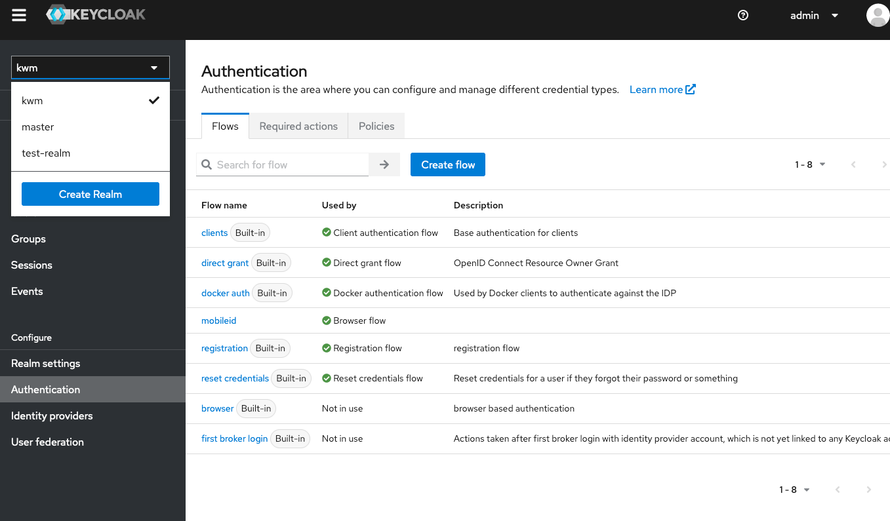
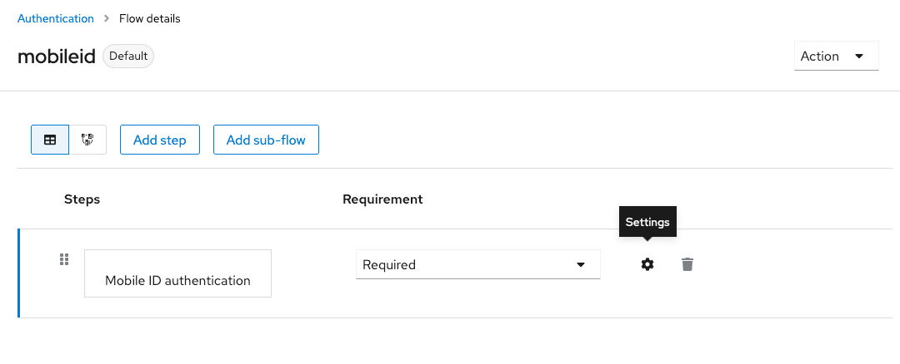
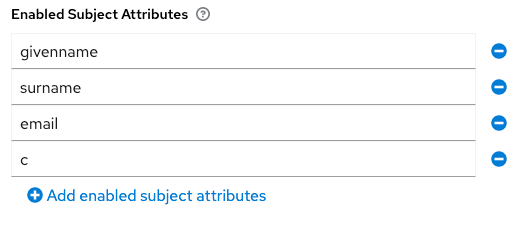

# Configuring MobileID authentication

**Note: Before trying to configure AP details, you should have a Client created. We are be using "kwm" (Kiuru web manager) as an example in this guide.**

To configure AP details you need to:

1. Login as an admin to Keycloak admin UI
2. Navigate to your KWM realm from the top left menu

3. Navigate to your mobileid authentication flow

4. Press the "settings" icon to see Mobile ID authentication config

Note: Authentication message here can be configured, but it will serve as an fallback, in case the client application does not provide a DTBD. In this case the authentication message would be "Authentication request from Kiuru Web Manager". Normally the relying party client decides the authentication message.

## Configuring enabled subject attributes

As subject received from MSSP can contain many different things, we need to configure what details we expect to get.

