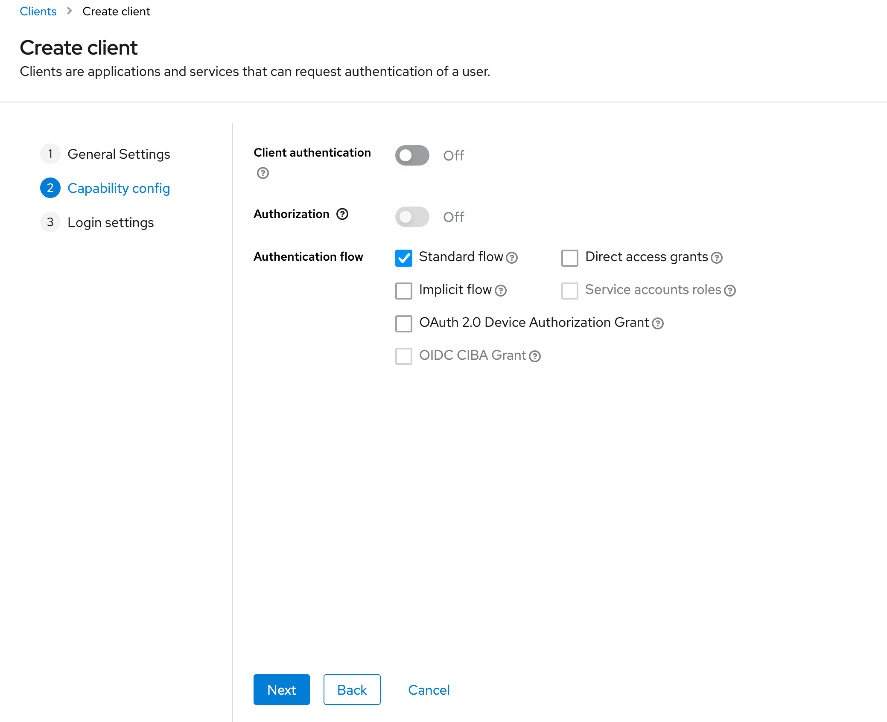
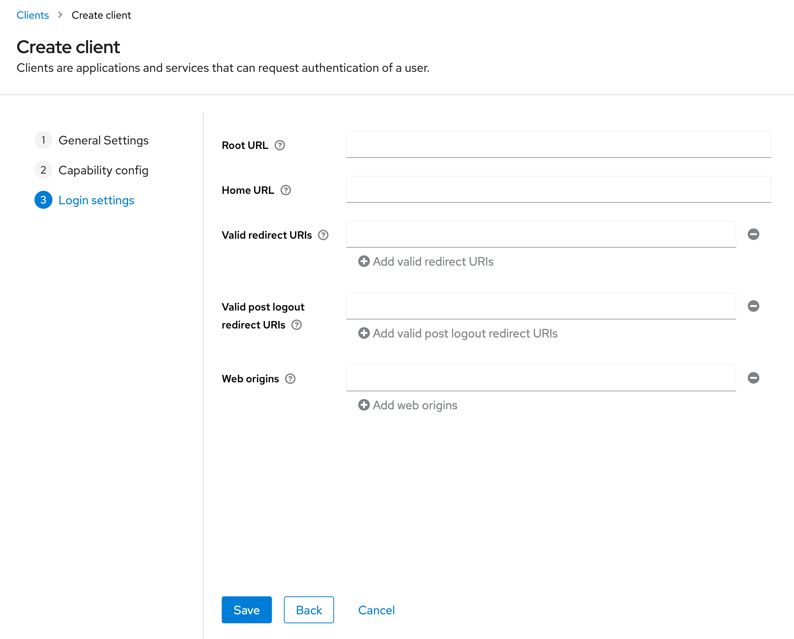

# Creating a new client

Clients are entities that can request Keycloak to authenticate a user.

When you want to integrate some application to your Keycloak server, it is required that you create a new Client. We will use Kiuru Web Manager as an example in this guide.

1. Navigate to http://localhost:8080/admin/master/console/#/REALM_NAME/clients/add-client
2. Set Client ID, other optional inputs and press next

3. Keep client authentication OFF, since we can't securely store client secret in the frontend app.
4. Select Standard flow and press next

5. Fill in details in Login Settings (http://localhost:8081 = local web manager)
6. Root URL should be the root URL of web manager
7. Home URL is the URL where Keycloak will redirect after authentication is complete. For example, if your frontend code expects the authorization code to be sent to http://localhost:8081/keycloak-login, you must use that specified URL.
8. Valid redirect URIs can be wildcarded, for example "http://localhost:8081/*". You may also specify multiple URLs without using the wildcard *
9. Valid post logout redirect URIs are the URLs keycloak sends the user after logout. For example http://localhost:8081/login
10. Web origins are for CORS. You can add for example http://localhost:8081/*

More client configurations can be done after client is created, for example requiring user consent for accessing user details.